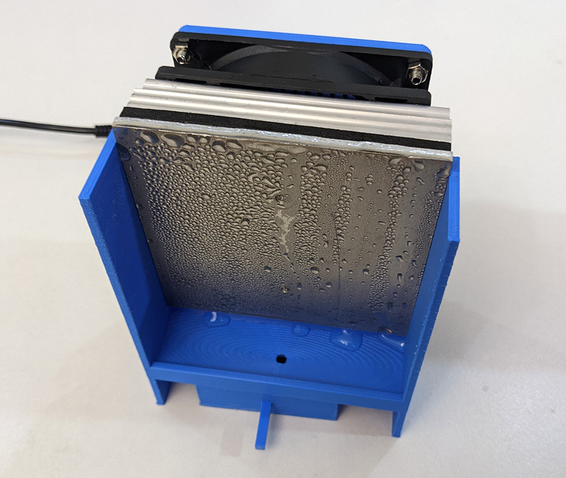

# 发水机！

大家是否经常受到停电停水的困扰呢？

停电的话，可以用发电机，但是停水的话，就没有办法了。

还好，聪明的莉沫酱改行当了物理学家，然后发明了发水机！

## 使用效果

就像这样，只要给发水机插上电，然后就可以看到水滴从上面流下来啦！

## 原理

发水机的原理很简单，就是利用水蒸汽在低温下凝结的特性，从空气中提取水分。

核心组件是中间的那个半导体制冷器，它能将它的一面接触到的物质变成低温，而另一面则变成高温。这样一来，水蒸汽就会在低温的一面凝结成水，从而形成水滴，然后被下面的漏斗收集起来，最后被送到水箱里。

## 构建

1. 去买一个半导体制冷器，形状差不多的就行。

2. 把`水机.blend`3D打印出来，然后把半导体制冷器装上去。

如果你买到的半导体制冷器的大小不太合适，可以自己用手调整一下`水机.blend`里的模型的尺寸。

## 注意

1. 这个装置可能会有一定的危险性，所以需要在有人监视的情况下使用。

2. 发出来的水是不干净的，所以不要喝。如果你真的想喝，要使用食品级的PLA材料打印，然后喝之前要先把水烧开。

## 结束

就这样，大家88，我去喝水了！
